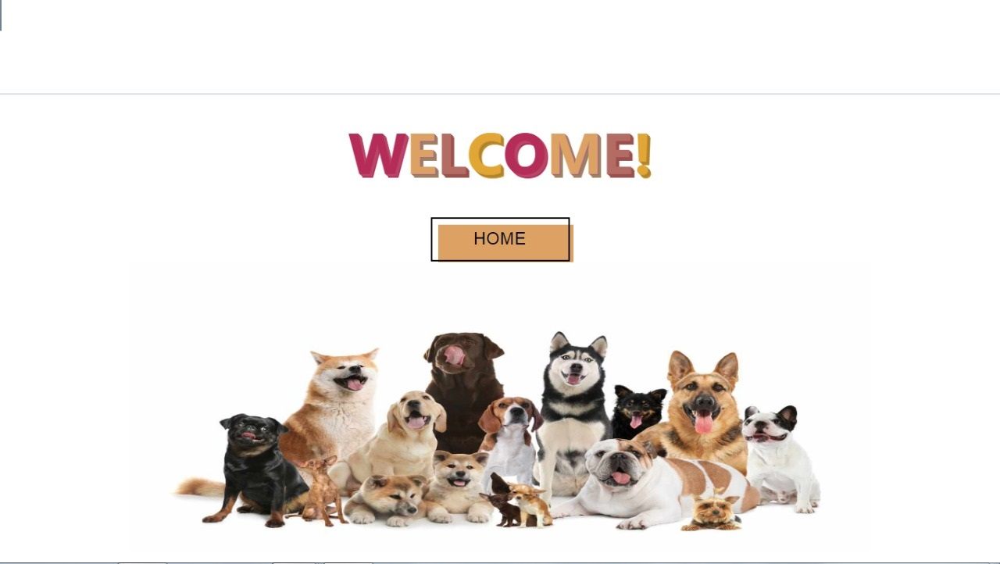
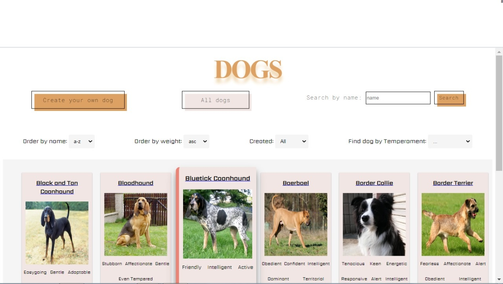
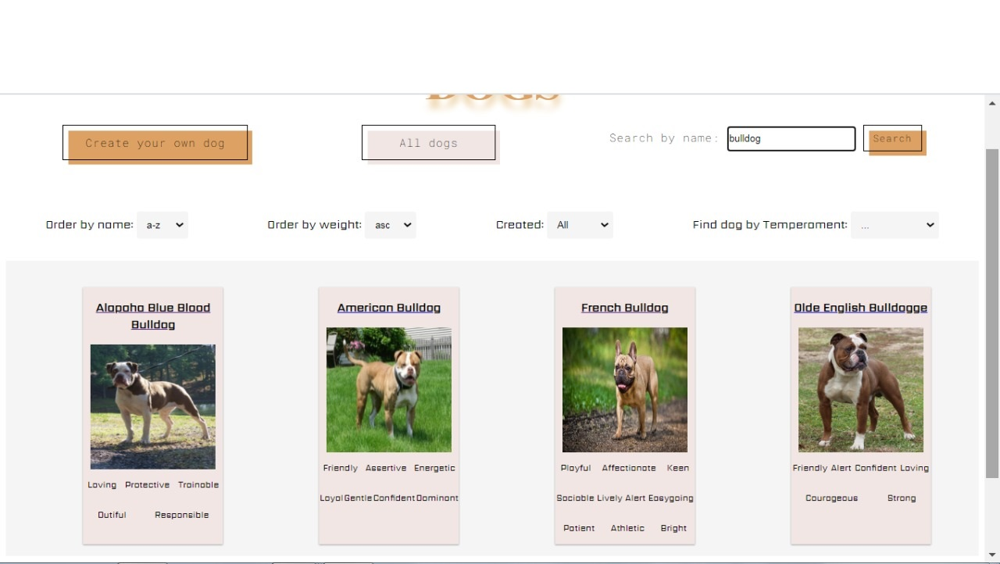
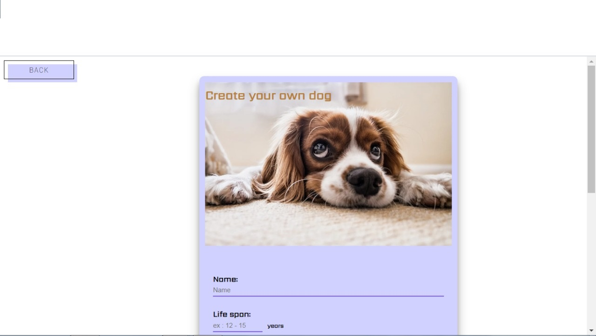
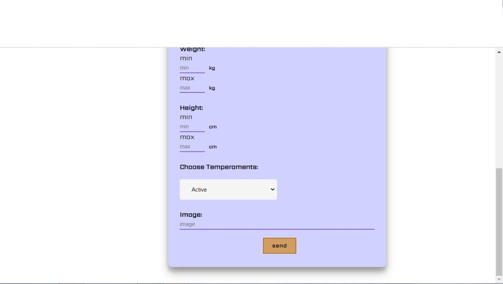
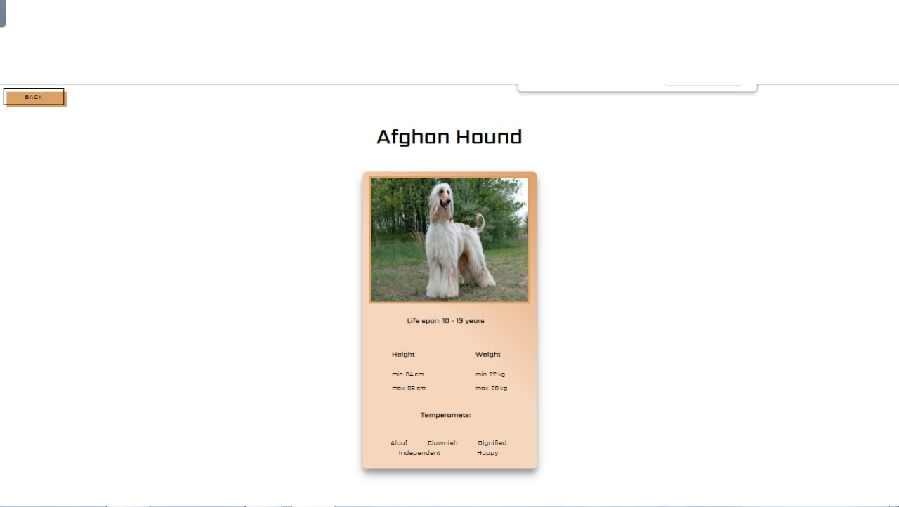

# Proyecto Individual - Henry Dogs
ES
Aquí pude desarrollar una aplicación que me traiga información de razas de perros en llamados a una Api, los cuales los he almacenado en mi entorno de Back-End y preparado la información para poder requerirlas desde mi entorno de Front-End. Asimismo se creo una base de datos usando Postgres en la cual se guardan perros creados desde un formulario en el Front. En esta sección, utilicé varios filtrados para poder adaptar mi búsqueda según mis gustos.Pudiendo cambiar entre la fuente de la información, ya sea desde la API con todas las razas traidas, como también de mi base de datos con las razas creadas. Pudiendo utilizar tanto el ordenamiento de A-Z, Z-A como también de mayor peso a menor y de menor a mayor peso.

EN
Here I was able to develop an application that brings me information about dog breeds in calls to an API, which I have stored in my Back-End environment and prepared the information to be able to request them from my Front-End environment. Likewise, a database was created using Postgres in which the dogs that are created from a form in the Front are saved. In this section, I used several filters to be able to adapt my search according to my tastes, being able to switch between the source of the information, either from the API with all the breeds brought, as well as from my database with the breeds created. Being able to use both the ordering of A-Z, Z-A as well as from greater weight to less and from less to greater weight.

## Objetivos del Proyecto

- Construir una App utlizando React, Redux, Node, Postgres y Sequelize.
- Aprender mejores prácticas.
- Aprender y practicar el workflow de GIT.
- Usar y practicar testing.

Objectives of the project:
- Devolep an App using React, Redux, Node, Postgres and Sequelize.
- Learnig about best practices.
- Learn and practice the GIT workflow.

#### Tecnologías utilizadas:
 Technologies

- [ ] React
- [ ] Redux
- [ ] Express
- [ ] Sequelize - Postgres

## Imagenes del proyecto
 
<h2 align="left">
🟨Landing Page
</h2>

  

 
<h2 align="left">
🟨Home
</h2>

  

 
<h2 align="left">
🟨Filter
</h2>

  

 
<h2 align="left">
🟨Create a dog
</h2>

  

 

  

 
<h2 align="left">
🟨Detail
</h2>

  

 
 
 
<h1>Muchas gracias por ver el proyecto 😁👋</h1>
<h1>Thank you for your time!! 😁👋</h1>
